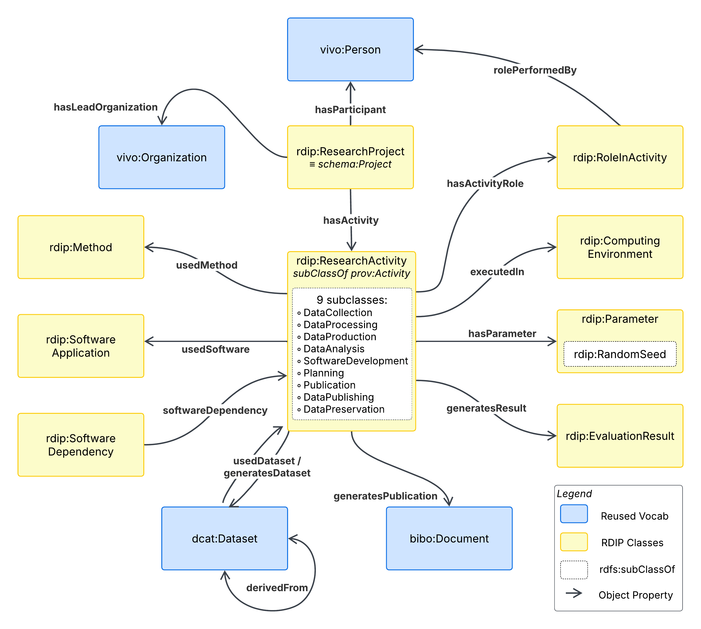

# RDIP — Research Data Intelligence Platform

[](https://opensource.org/licenses/MIT)
[](https://open-rdip.github.io/core-ontology/)

**A project-centric integration profile for FAIR research lifecycle provenance.**

It contains the ontology, the evaluation corpus, the gold knowledge graph, the LLM extraction experiment artefacts, and all scripts required to reproduce the results reported in Section 4 of the paper.

## Quick links

| Resource | Location |
|---|---|
| Ontology (PURL) | https://w3id.org/rdip |
| Ontology (Widoco docs, v2) | https://open-rdip.github.io/core-ontology/ |
| Ontology (Widoco docs, v1) | https://open-rdip.github.io/core-ontology/v1/ |
| Ontology source (Turtle) | [`rdip.ttl`](./rdip.ttl) |
| Examples (case studies) | [`examples.ttl`](./examples.ttl) |
| Gold knowledge graph (merged) | [`combined_gold.ttl`](./combined_gold.ttl) |
| DCAT+PROV-O baseline queries | [`comparison/`](./comparison) |
| Schema coverage summary | [`coverage_summary.md`](./coverage_summary.md) |
| LLM extraction prompts and outputs | [`llm_experiment/`](./llm_experiment) |
| Scoring results | [`scores.csv`](./scores.csv) |

## Repository layout

```
.
├── rdip.ttl                  # RDIP ontology v2 (current release)
├── rdip-v1.ttl               # RDIP ontology v1 (prior release, retained for provenance)
├── examples.ttl              # Three case-study instantiations (CS / Business / Medical)
├── examples-v1.ttl           # Case studies under v1
├── rdip.md                   # Mermaid overview of v2
├── rdip-v1.md                # Mermaid overview of v1
├── v2.md                     # Competency-question SPARQL queries (v2)
│
├── combined_gold.ttl         # Merged RDIP-compliant KG over 12 gold papers (344 triples)
│
├── comparison/               # DCAT+PROV-O baseline (§4.1)
│   ├── baseline_dcat_prov.ttl
│   └── comparison_queries.md   # Q1–Q5 SPARQL queries
│
├── coverage_summary.md       # Schema coverage analysis across 95 papers (§4.3)
│
├── gold/                     # 12 gold papers — paper-only annotations
│   └── studyNNN/gold_standard.json
│
├── gold_full/                # 12 gold papers — full annotations + repo metadata + triples
│   └── studyNNN/{gold_standard.json, repo_metadata.json, triples.ttl}
│
├── silver/                   # 83 silver papers — schema-level annotations only
│   └── studyNNN/{gold_standard.json, prompt.txt, repo_metadata.json}
│
├── llm_experiment/           # Three-condition LLM extraction experiment (§4.4)
│   └── studyNNN/
│       ├── prompt_c1.txt     # C1: generic
│       ├── prompt_c2.txt     # C2: DCAT + PROV-O
│       ├── prompt_c3.txt     # C3: RDIP
│       └── outputs/{c1,c2,c3}_output.json
│
├── pdfs/                     # Source PDFs of all 95 papers (needs to be downloaded)
│   └── studyNNN.pdf
│
├── repo_list.csv             # GitHub repository URLs and reproducibility-tier metadata
├── scores.csv                # LLM extraction scores (entity + relation F1)
│
└── scripts/
    ├── download_pdfs.py        # Download arXiv PDFs from repo_list.csv
    ├── extract_repo_metadata.py # Pull dependencies / Docker / seeds from GitHub
    ├── generate_prompts.py     # Build C1/C2/C3 prompts for each paper
    ├── setup_experiment.py     # Orchestrate the LLM run
    ├── verify_experiment.py    # Sanity-check that all prompts/outputs are present
    ├── verify_output.py        # Validate JSON conformance to the RDIP schema
    ├── create_paper_gold.py    # Strip repo-derived entities from gold for fair scoring
    ├── score_llm.py            # Compute strict / relaxed / normalised F1
    ├── analyze_coverage.py     # Generate the coverage table (§4.3)
    └── json_to_turtle.py       # Convert annotation JSON to RDIP-compliant Turtle
```

## What is in `gold/` vs `gold_full/` vs `silver/`?

The corpus is partitioned as described in Section 4.2 of the paper:

- **`gold_full/` (12 papers):** Exhaustively annotated. Each paper received ~30 minutes of expert verification covering entity completeness, relation correctness, and adherence to the RDIP schema. Includes repository-derived data (exact dependency versions, Docker config, random seeds extracted from source).
- **`gold/` (12 papers):** Same 12 papers as `gold_full/`, but with repository-derived entities **removed**. This is the *paper-only* gold standard used for scoring the LLM extraction experiment, which only sees PDF text. Generated by [`scripts/create_paper_gold.py`](./scripts/create_paper_gold.py).
- **`silver/` (95 papers):** Schema-level verification only (~15 minutes per paper). Used for the coverage analysis in Section 4.3, which asks *"does this paper contain information mappable to RDIP class X?"* — not whether every individual entity instance is correctly extracted. Note: the 12 gold papers are also represented here; the silver dataset reported in Table 4 (n=83) is `silver \ gold`.

## Reproducing the results

### Prerequisites

- Python 3.10+
- `rdflib`, `pandas`, `requests`, `python-dotenv`
- A Gemini API key for the LLM extraction (set `GEMINI_API_KEY` in `.env`)
- Java 11+ (for Widoco, optional — only required to regenerate ontology docs)
- Protégé 5.6+ (optional — for inspecting the ontology and running CQ SPARQL queries interactively)

```bash
pip install -r requirements.txt    # if a requirements file is present
# or:
pip install rdflib pandas requests python-dotenv google-generativeai
```

### 1. Section 4.1 — DCAT+PROV-O baseline

Load the merged gold KG and the baseline graph into an RDF store, then run the queries:

```bash

arq --data combined_gold.ttl --query comparison/queries/Q1.rq

```

Expected outcome: Q1, Q2, Q4, Q5 return zero rows under DCAT+PROV-O constructs alone; Q3 returns partial results (no role vocabulary). The same queries run with `rdip:` prefixes return the expected non-empty results.

### 2. Section 4.2 — Gold KG and competency questions

```bash

python scripts/json_to_turtle.py --input gold_full/ --output combined_gold.ttl

```

All 11 CQs return non-empty results.

### 3. Section 4.3 — Schema coverage

```bash
python scripts/analyze_coverage.py \
    --gold gold_full/ \
    --silver silver/ \
    --output coverage_summary.md
```

Produces the coverage table reported in Table 5.

### 4. Section 4.4 — LLM extraction experiment

```bash
# (a) Generate prompts for all 12 gold papers under all 3 conditions:
python scripts/generate_prompts.py --gold gold/ --pdfs pdfs/ --out llm_experiment/

# (b) Run extraction (Gemini 3 Flash; one fresh session per paper-condition):
python scripts/setup_experiment.py --experiment llm_experiment/

# (c) Validate output conformance:
python scripts/verify_output.py --experiment llm_experiment/

# (d) Score against the paper-only gold standard:
python scripts/score_llm.py \
    --gold gold/ \
    --predictions llm_experiment/ \
    --output scores.csv
```

The reported numbers (Entity F1 of 0.502 / 0.570 / 0.495 for C1 / C2 / C3, and Relation F1 of 0.000 / 0.046 / 0.099) are computed by `score_llm.py` under the relaxed evaluation protocol described in Section 4.4.

## Ontology design at a glance



RDIP composes five established vocabularies under a project-centric coordination layer:

| Reused vocabulary | Used for |
|---|---|
| **VIVO** | People (`vivo:Person`), organisations (`vivo:Organization`), affiliations |
| **DCAT** | Datasets and distributions |
| **PROV-O** | Activities and qualified provenance |
| **BIBO** | Publications and bibliographic resources |
| **CiTO** | Typed citation relations |
| **Schema.org** | Crosswalk mappings only (e.g., `rdip:ResearchProject ≡ schema:Project`) |

The RDIP namespace adds 25 classes, 25 object properties, and 44 datatype properties (514 triples, parses without errors in Protégé and rdflib). Resolves at https://w3id.org/rdip via content negotiation.

The four reproducibility-oriented constructs introduced by RDIP — `rdip:Parameter` / `rdip:RandomSeed`, `rdip:ComputingEnvironment`, `rdip:EvaluationResult`, and `rdip:SoftwareDependency` — are grounded in the ML Reproducibility Checklist (Pineau et al. 2021), the ACM Artifact Review and Badging policy (2020), and Gundersen & Kjensmo's taxonomy of AI reproducibility factors (2018).

## Versioning

| Version | Status | IRI |
|---|---|---|
| 2.0.0 | Current release | https://w3id.org/rdip/2.0.0/ |
| 1.0.0 | Prior release (retained for provenance) | https://w3id.org/rdip/1.0.0/ |

Version 2 added qualified PROV-O associations, dataset derivation chains (`prov:wasDerivedFrom`), activity sequencing (`prov:wasInformedBy`), `rdip:EvaluationResult`, `rdip:SoftwareDependency`, `rdip:EnvironmentSpec`, and `rdip:RandomSeed`; it also fixed a `landingPage` range conflict and removed duplicate class declarations from v1.

## Related artefacts

- **Widoco documentation:** generated from the Turtle sources using [Widoco](https://github.com/dgarijo/Widoco) (Garijo, ISWC 2017). See [Generating documentation](#generating-documentation) below.
- **Persistent identifier:** registered via [w3id.org](https://w3id.org), redirecting to the documentation site with HTTP content negotiation.

## Limitations

The corpus consists exclusively of machine-learning papers. While RDIP's design is domain-agnostic, applicability in other disciplines (social sciences, humanities, life sciences) remains to be validated empirically. Annotation was performed by a single domain expert; we mitigate this through tiered verification and full publication of all prompts, outputs, and verification records (this repository), but inter-annotator agreement is not reported. The LLM extraction experiment uses Gemini 3 Flash as the sole extraction model. See Section 5 of the paper for the full discussion.

## License

- **Ontology (`rdip.ttl`, `rdip-v1.ttl`, `examples*.ttl`)**: [MIT License](https://opensource.org/licenses/MIT)
- **Code (`scripts/`)**: MIT License
- **Documentation and annotations (`gold/`, `gold_full/`, `silver/`, `coverage_summary.md`)**: [CC-BY 4.0](https://creativecommons.org/licenses/by/4.0/)
- **PDFs (`pdfs/`)**: retained under the original publishers' terms (arXiv preprints).
